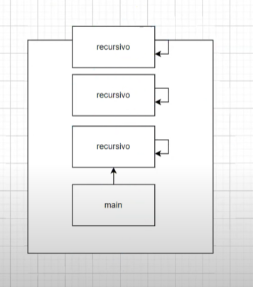
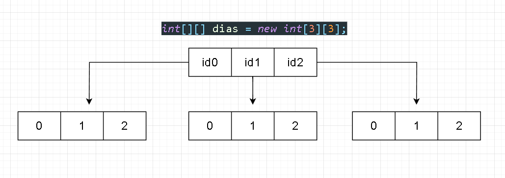
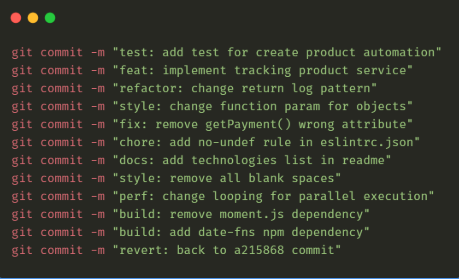
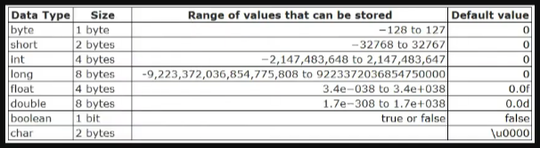
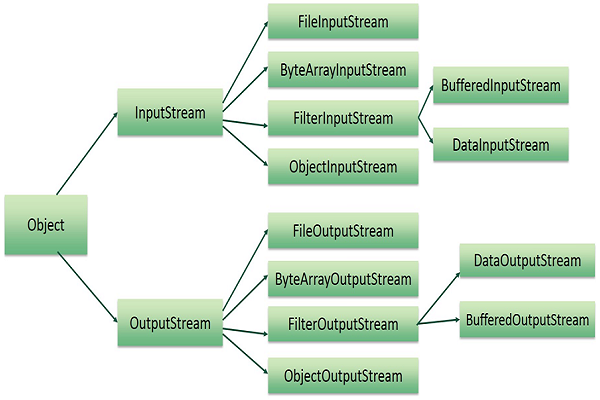
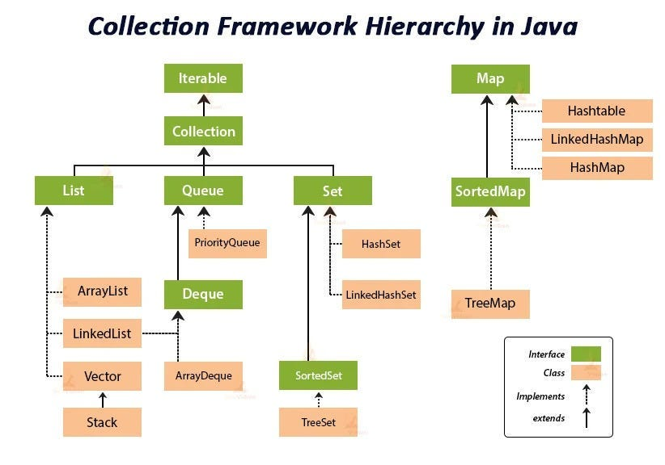
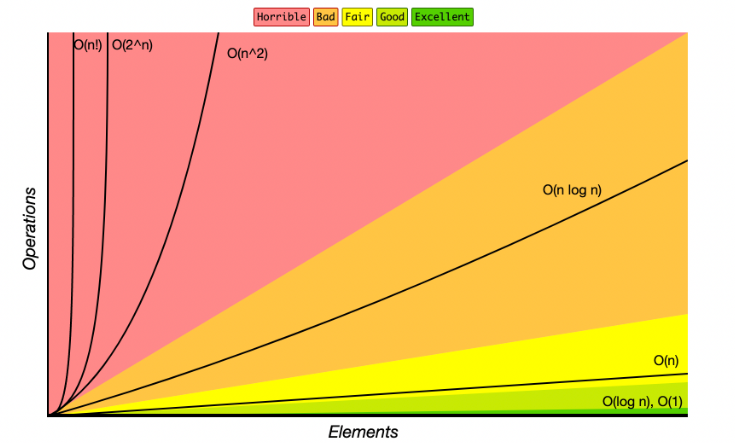
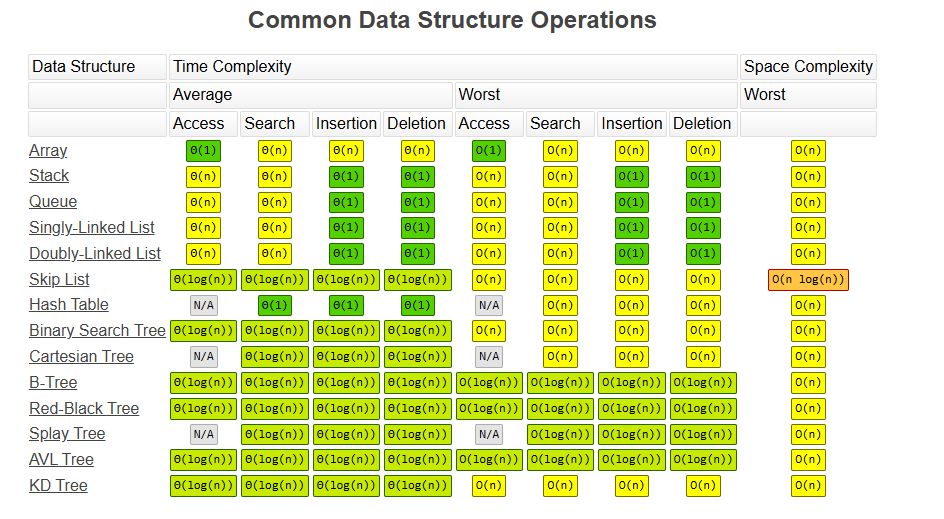
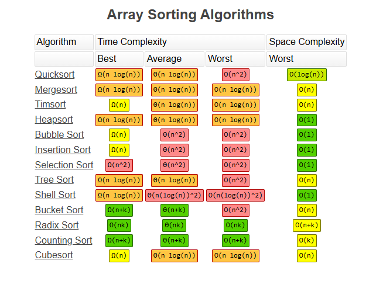
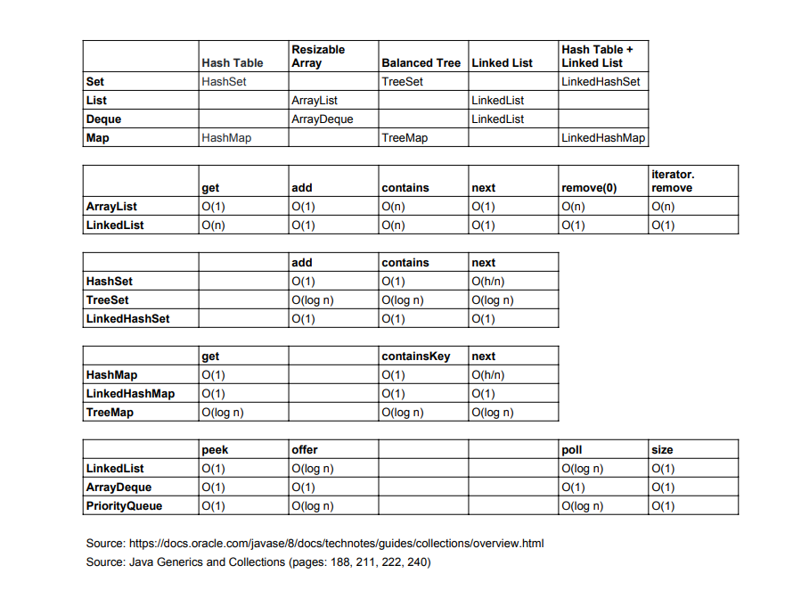

## Hello, Git!

### Primitive types
#### (1 byte = 8 bits)

### Arrays Multidimensionais

### Conventional Commits

### Exceptions:

### Java Files and I/O

### Collection

### Big-O Complexity Chart

 (https://www.bigocheatsheet.com/)

### Common Data Structure Operations

 (https://www.bigocheatsheet.com/)

### Array Sorting Algorithms 

 (https://www.bigocheatsheet.com/)

### Java collection complexity

 (https://www.cl.cam.ac.uk/teaching/1819/OOProg/complexity.pdf)